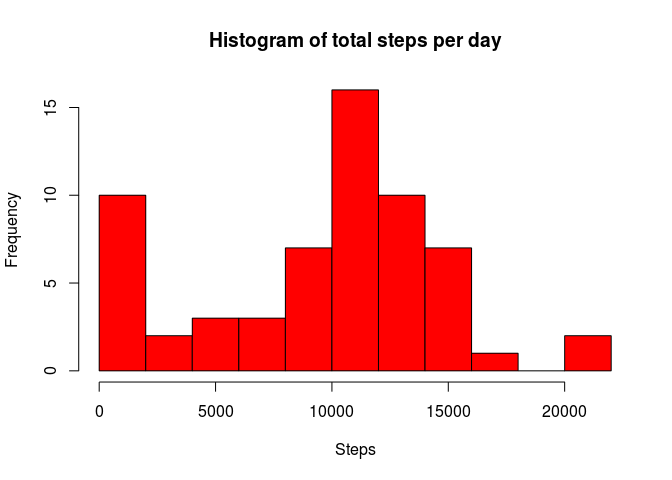
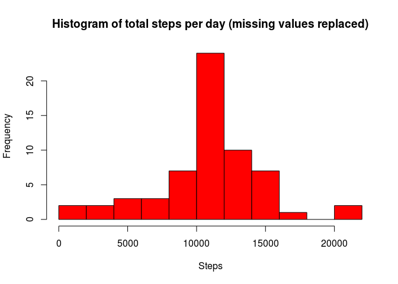

# Reproducible Research: Peer Assessment 1


## Loading and preprocessing the data

```r
library("data.table")
library("lubridate")
unzip("activity.zip")
act<-data.table(read.csv("activity.csv"))
act[,date:=ymd(date)]
act[,interval:=as.character(format(interval,digit=4))]
```


## What is mean total number of steps taken per day?

```r
# Total number of steps per day
total_spd<-act[,sum(steps,na.rm=TRUE),by=date]
hist(total_spd$V1,main = "Histogram of total steps per day", xlab="Steps",col="red",nclass=10)
```

 

```r
# Mean steps per day
mean_spd<-mean(total_spd$V1,na.rm=TRUE)
# Median steps per day
median_spd<-median(total_spd$V1,na.rm=TRUE)
```
The mean total number of steps taken per day is 9354.23, median number of steps taken per day is 10395.


## What is the average daily activity pattern?

```r
# Calculating mean steps in the 5-minute interval
act_ptn<-act[,mean(steps,na.rm=TRUE),by=interval]
plot(act_ptn,type="l",ylab="Number of steps")
```

 

```r
# Interval that contains the maximum number of steps
max_interval<-act_ptn[V1==max(act_ptn$V1),interval]
```
The 5-minute interval, on average across all the days in the dataset, that contains the maximum number of steps is  835

## Imputing missing values

```r
# Calculating the number of missing values
missing<-act[is.na(steps)]
total_na<-NROW(missing)
setkey(act_ptn,interval)
setkey(missing,interval)
# Replacing the missing values with the mean for that 5-minute interval
filled<-missing[act_ptn,steps:=as.integer(round(V1,0))]
setkey(filled,date,interval)
act_fill<-act
setkey(act_fill,date,interval)
act_fill[filled,steps:=i.steps]
# Total number of steps per day (missing values replaced)
total_spd_fill<-act_fill[,sum(steps,na.rm=TRUE),by=date]
hist(total_spd_fill$V1,main = "Histogram of total steps per day (missing values replaced)", xlab="Steps",col="red",nclass=10)
```

 

```r
# Mean steps per day (missing value replaced)
mean_spd_fill<-mean(total_spd_fill$V1,na.rm=TRUE)
# Median steps per day (missing value replaced)
median_spd_fill<-median(total_spd_fill$V1,na.rm=TRUE)
```
The total number of missing values in the dataset is 2304. Replacing the missing values with the mean for that 5-minute interval changes the mean steps per day in 1.076564\times 10^{4} and the median in 10762 (percentage change compared to the previous mean 15.09% and median 3.53%)

## Are there differences in activity patterns between weekdays and weekends?


```r
# Creating a new factor variable in the dataset with two levels – “weekday” and “weekend” indicating whether a given date is a weekday or weekend day. "Sabato"=="Saturday" and "Domenica"=="Sunday" (italian)
act_fill[weekdays(date)=="sabato"|weekdays(date)=="domenica",wday:=as.factor("weekend")]
act_fill[is.na(wday),wday:=as.factor("weekday")]
# Calculating mean steps in the 5-minute interval averaged across all weekday days or weekend days
act_ptn_fill<-act_fill[,mean(steps,na.rm=TRUE),by=c("interval","wday")]
act_ptn_fill[,plot(interval,V1,type="l",ylab="Number of steps",main=wday),by=wday]
```

  
